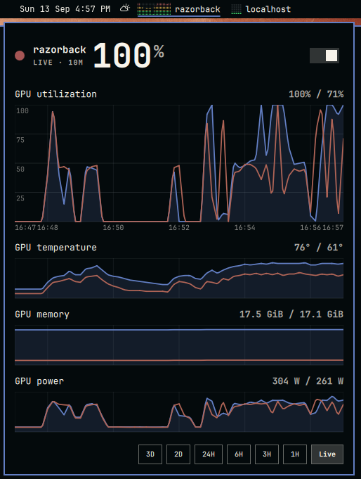

# omarchy-netdata

Omarchy Quattro menubar widget for tracking GPU usage of a remote host via a [Netdata](https://www.netdata.cloud/) remote host. Useful when running local AI on anther dedicated machine. Shows GPU utilization in the menubar and a historical chart in a popup. Will be adding more metrics over time.



## Features

- Bar pill with a status mark and the configured hostname
- Click the pill for a theme-following popup with current usage, a historical GPU utilization chart, and a smaller GPU temperature chart locked to the same time window
- Scroll to zoom the time window; drag to pan
- Preset chips: 3D, 2D, 24H, 6H, 3H, 1H, and Live
- Colors follow the active Omarchy theme (`Color` / `Style`)
- Status mark states:
  - Grey square outline when polling is stopped
  - Grey solid circle when polling but the host is unreachable
  - Green below 30% GPU, yellow from 30–70%, red above 70%
- Green and yellow stay semantic so themes that alias `green` to gold still read correctly

Default host is `localhost` (port `19999`). The default `gpu` is `nvidia`, which uses Netdata **v3** context `nvidia_smi.gpu_utilization`. Set `gpu` to `amd` for AMD. Leave `gpu` blank for the same nvidia charts. Set `context` / `tempContext` to override either chart.

## Install

```bash
omarchy plugin add https://github.com/BonesGit/omarchy-netdata.git --enable
```

The widget lands in the right section of the bar. Update with `omarchy plugin update io.github.bonesgit.omarchy-netdata`. Remove with `omarchy plugin remove io.github.bonesgit.omarchy-netdata`.

### Manual install

Omarchy refuses symlinks inside a plugin folder, so if you cloned this repo, copy it in:

```bash
mkdir -p ~/.config/omarchy/plugins/io.github.bonesgit.omarchy-netdata
rsync -a --delete --exclude .git ./ ~/.config/omarchy/plugins/io.github.bonesgit.omarchy-netdata/
omarchy plugin validate ~/.config/omarchy/plugins/io.github.bonesgit.omarchy-netdata
omarchy-shell shell rescanPlugins
omarchy plugin enable io.github.bonesgit.omarchy-netdata --section right --after omarchy.tray
```

After editing this repo, rsync again and restart the shell. Live bar instances do not pick up plugin-dir copies on their own; `omarchy-shell shell rescanPlugins` is not enough.

```bash
rsync -a --delete --exclude .git ./ ~/.config/omarchy/plugins/io.github.bonesgit.omarchy-netdata/
omarchy plugin validate ~/.config/omarchy/plugins/io.github.bonesgit.omarchy-netdata
omarchy restart shell
```

## Dependencies

- **[Netdata](https://www.netdata.cloud/)** agent reachable from your machine (default `localhost:19999`). The plugin polls the Netdata **v3** HTTP API.
- `curl` — used for live and history fetches. Omarchy already ships it.
- `omarchy-launch-browser` — opens the Netdata dashboard when you click the hostname in the popup.
- **Default GPU:** `nvidia` (`nvidia_smi.gpu_utilization`). `amd` uses `amdgpu.gpu_utilization`. Blank `gpu` is the same as `nvidia`. Override either chart with `context` / `tempContext`.

The plugin only reads metrics from the host you configure. It does not install Netdata, collect GPU data itself, or modify your Netdata configuration.

## Remove

```bash
omarchy plugin remove io.github.bonesgit.omarchy-netdata
```


## Settings

Set from the bar or `shell.json`:

```bash
omarchy bar set io.github.bonesgit.omarchy-netdata host myhost
omarchy bar set io.github.bonesgit.omarchy-netdata refreshSeconds 5
omarchy bar set io.github.bonesgit.omarchy-netdata retryAttempts 5
omarchy bar set io.github.bonesgit.omarchy-netdata gpu amd
omarchy bar set io.github.bonesgit.omarchy-netdata split true
omarchy bar set io.github.bonesgit.omarchy-netdata dashboardUrl http://localhost:19999/#menu_system_submenu_gpu
```

`host` accepts `hostname`, `hostname:port`, `http://hostname:port`, or an IP. Port defaults to `19999`.

`dashboardUrl` is what the popup hostname opens in the browser. Leave it empty to use `http://<host>:<port>`.

`retryAttempts` is consecutive failed live polls before the widget auto-stops (default 5). The wait between those polls is `refreshSeconds` (default 5). A successful poll resets the counter. Start resumes polling.

`gpu` is `nvidia` or `amd` (default `nvidia`). Blank is the same as `nvidia`. That pick supplies both the utilization and temperature charts. Set `context` or `tempContext` to override one or both. If you override `context` and leave `tempContext` blank, temperature is auto-picked from the override context (so an AMD context still gets the `amdgpu` sensors instance).

`split` (default off) draws one line per GPU on both charts instead of one averaged line. The second line uses the theme's urgent color. The bar pill and hero number show the hottest GPU. Per-GPU values appear in the tooltip and the temperature label. Split mode adds Netdata's `group_by=instance` to the query.

The bar stays utilization-only. Temperature is a smaller popup chart under utilization, sharing pan/zoom and showing the current degrees next to its title. A failed temp poll never stops the widget.

`allowMultiple` is on, so you can put another copy on the bar later and point it at a different machine. Dual-monitor copies of the same host share one poller, so online/offline and start/stop stay in sync.

## Popup

- Left click the pill: open / close
- Click the hostname in the popup: open Netdata in the browser
- Right or middle click: refresh now
- Scroll on the chart: zoom time range around the cursor (up to 3 days)
- Drag the chart: pan in time. The temperature chart stays locked to the same window.
- Stop switch (top right): start/stop automatic Netdata polling. Consecutive failed polls auto-stop after `retryAttempts`.
- `3D` / `2D` / `24H` / `6H` / `3H` / `1H` / `Live` chips: jump the window
- `+` / `-` or up / down: zoom
- left / right: pan
- `0` or Live: jump back to a live 10-minute window
- `r`: refresh
- Esc: close


## Layout

```
manifest.json      plugin contract
BarWidget.qml      bar pill + panel host
Panel.qml          KeyboardPanel popup
Service.qml        plugin singleton; one Poller per host+charts
Poller.qml         Netdata v3 polling
GpuChart.qml       pan/zoom canvas
Model.js           parse / window math
```

This follows the Omarchy marketplace bar-widget + nested panel pattern.

## Coming soon

More netdata metrics and visualizations coming soon.